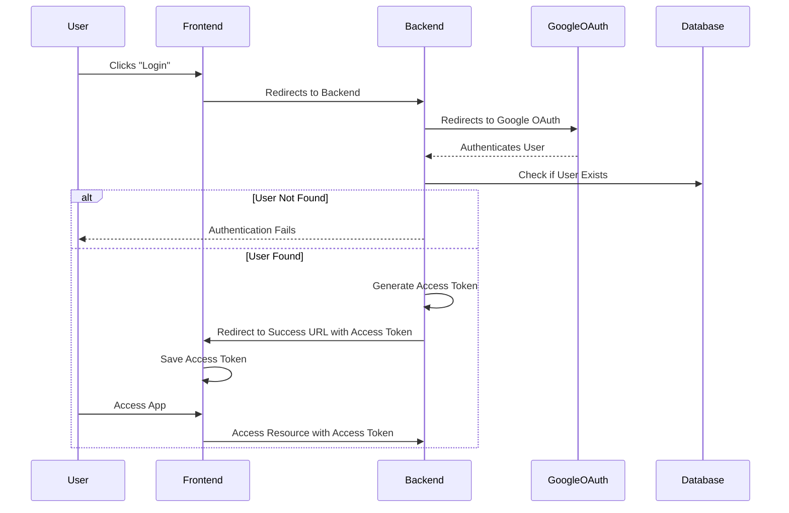
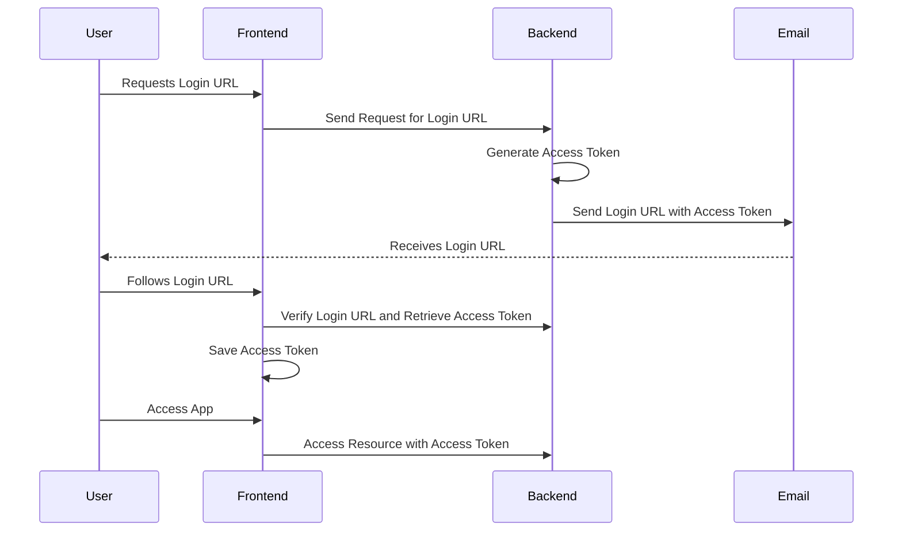

The Contest Monitoring System uses Google OAuth for user authentication. Users must authenticate with their organizational email to access the system.

:::warning
Students are registered to the database manually. Registration is not open to the public. Potential improvement includes allowing heads to add students to the system or send invitations.
:::

Below are the two primary authentication flows:

### OAuth Authentication

In this flow, the user initiates the login process through a redirect to Google OAuth.

### Login URL via Email

In this flow, the user can request a login URL, which is sent to their email.

