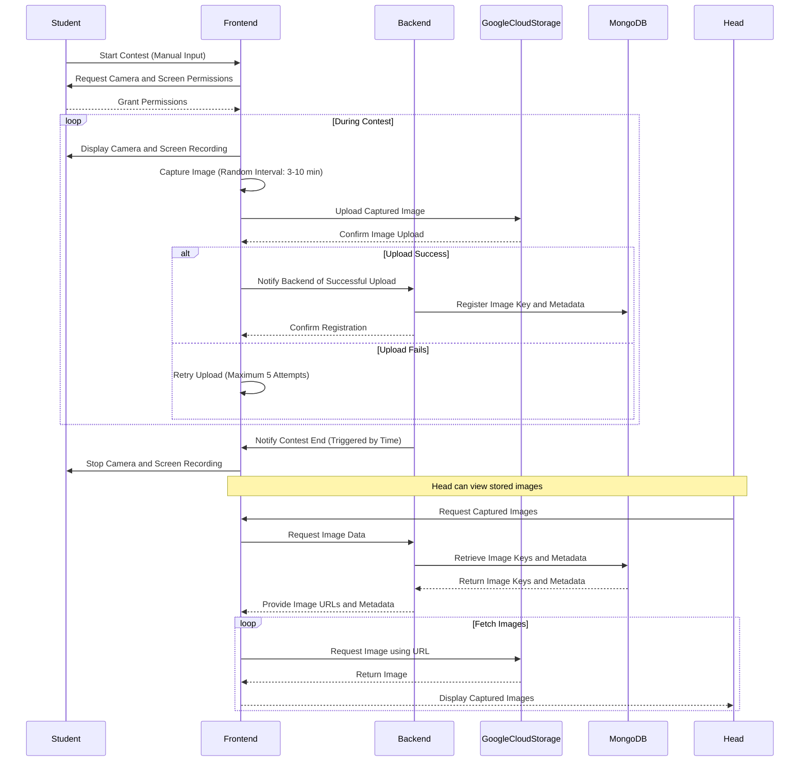

The monitoring system is designed to facilitate and oversee remote contests while ensuring the integrity of the contest process. Below is a step-by-step outline of the system's flow, from contest creation to image monitoring and storage.

### 1. Contest Creation

- **Heads** have the ability to create contests within the system.
- When a contest is created, it is added to the system and becomes visible to all students. The actual contest is conducted on codeforces.
- Contest details, such as the codeforces contest url, start and end time, are configured during creation.

### 2. Student Registration

- Once a contest is created, students can view it in the list of available contests.

### 3. Image Capturing

- **Screen and Camera Monitoring**:
  - The monitoring system captures images from both the student’s screen and their camera at random intervals throughout the contest.

- **Image Upload and Storage**:
  - Captured images are uploaded to **Google Cloud Storage**.

- **Database Logging**:
  - The system stores the keys (references) to the uploaded images in a **MongoDB** database.

### 5. Post-Contest Review

- After the contest has concluded, **Heads** can review the captured images.

## Diagram

